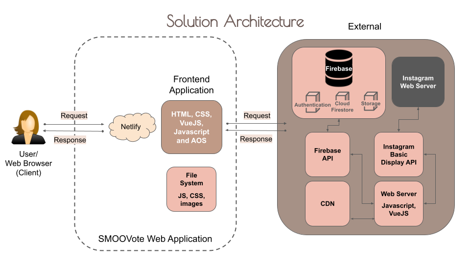
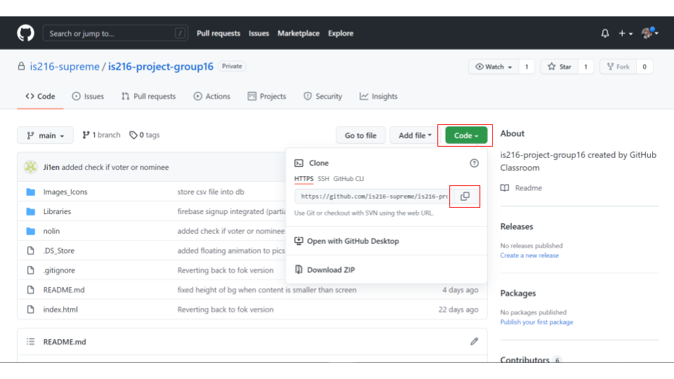
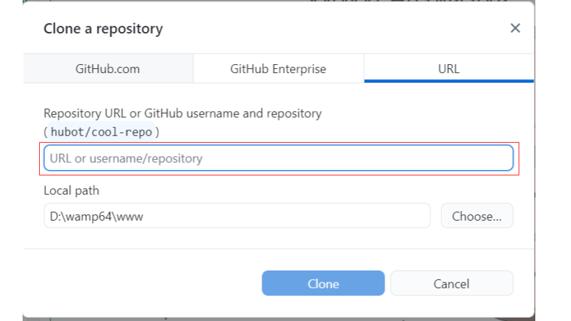
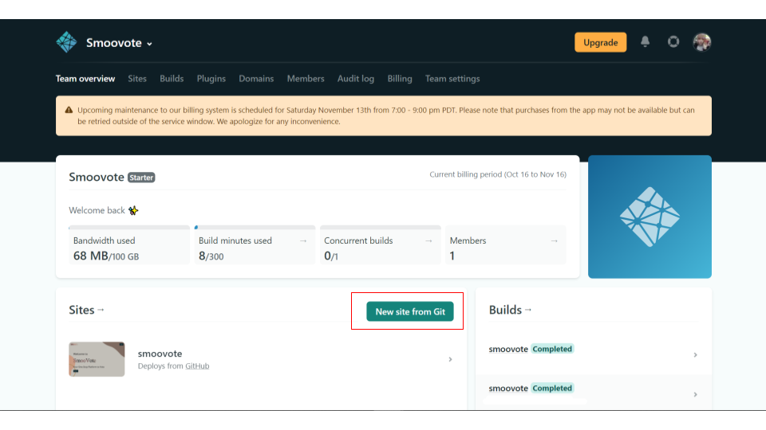
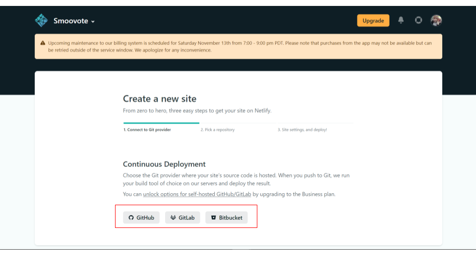
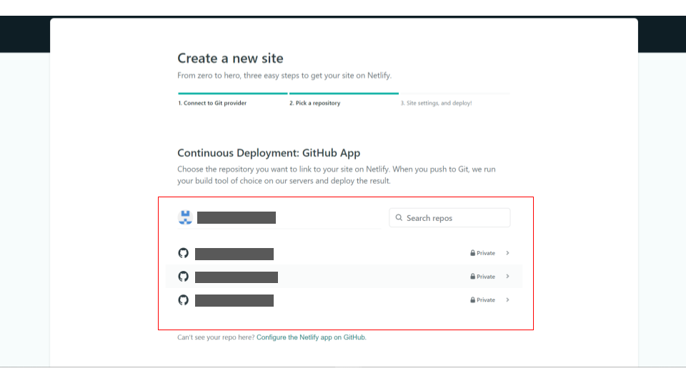
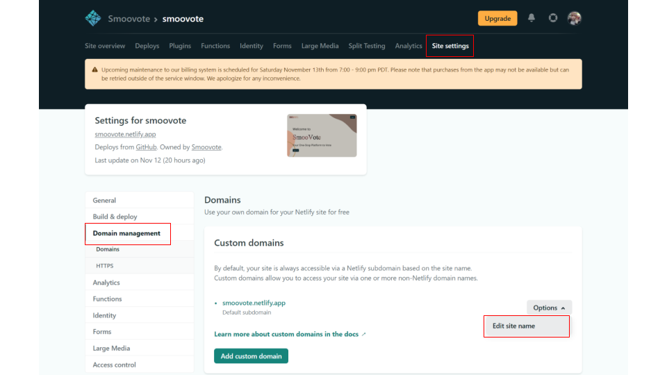
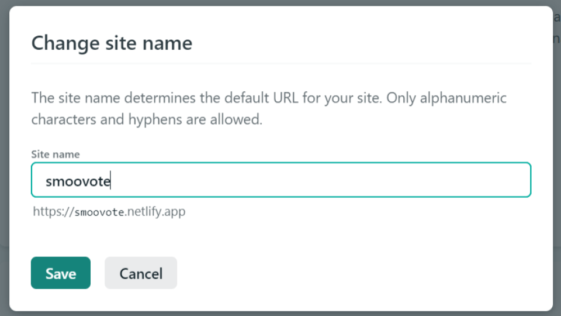

# :wave: is216-project

## 👉 IS216 - Group 16 - SMOOVote
#### Members:
* Bruno Goh Jing Hang (bruno.goh.2020@scis.smu.edu.sg)
* Fok Jia Yi (jiayi.fok.2020@scis.smu.edu.sg)
* Yap Jie En Kelvin (kelvin.yap.2020@scis.smu.edu.sg)
* Nolin Ho Rui Ling (nolin.ho.2020@scis.smu.edu.sg)
* Sathish Kumar Muthukumar (sathishkm.2020@scis.smu.edu.sg)
* Tanya Elizabeth Khoo (tanyakhoo.2020@scis.smu.edu.sg)

## 👉 Project Overview ##

* SMOOVote is a online voting application that enables students to vote and access all relevant information regarding exisiting elections they are eligible to vote for, such as campaigning efforts and the social media platforms of the running nominees.
* Solution Overview:  

* Figma Prototype (For admins): [Prototype Link](https://www.figma.com/proto/J1Gy5l5cgyosUV881uYXUu/smoovote?node-id=398925%3A1060&scaling=contain&page-id=77%3A432&starting-point-node-id=398914%3A660&show-proto-sidebar=1)
* Figma Prototype (For normal users): [Prototype Link](https://www.figma.com/proto/J1Gy5l5cgyosUV881uYXUu/smoovote?node-id=398925%3A1060&scaling=contain&page-id=77%3A432&starting-point-node-id=398925%3A1060&show-proto-sidebar=1)

## 👉 How to Install and Run Our Web Application (for Developers) ##

1. Head over to our [repository](https://github.com/is216-supreme/is216-project-group16) on GitHub and select the "Code" drop down. Copy the URL. 
2. Open GitHub Desktop and paste the URL into the first input box. Select the location you want the clone of the repository (it has to be pointed to an empty folder). Select "Clone" and you are done! 

## 👉 How to Deploy Our Web Application (for Developers) ##

* We hosted our website on [Netlify](https://www.netlify.com/) as it allowed us to connect our GitHub repository and it supported automatic builds to our website with every commit in GitHub.
* Below are the steps to host your website on Netlify:
1. Go to [Netlify](https://www.netlify.com/) and sign in to your GitHub account 
2. Once logged in, select "New site from Git" 
3. Choose the Git provider for your site and authorise your account 
4. Select the repository that the source code is in and complete the deployment process 
5. (Optional) If you wish to change the subdomain name, you can head to Site Settings > Domain Management > Domains > Custom domains and edit the site name.  
6. Your site is now deployed!

## 👉 How to Use Our Web Application (for Visitors to our Website) ##

You can refer to these user guides for more:
* [Voter and Nominee User Guide](https://docs.google.com/document/d/1vmI_3o1VEg3JezUymq8B2Gl3QUkZZcfCIB-SLc-upag/edit?usp=sharing)
* [Admin User Guide](https://docs.google.com/document/d/1rPdzVc_kaLttS4zoCT6OxV0oV4_KHy-SeeHZgs5VuAo/edit?usp=sharing)

## 👉 Other Things ##

1. Data and authentication is done through Firebase. In order to gain access to the developer console for firebase, do email sathishkm.2020@smu.edu.sg with your non smu gmail address to gain access. 
2. Users can only sign up through their smu domain email 
3. Admins are unable to sign up. CCA incharge has to email website owner at sathishkm.2020@smu.edu.sg to request for access
5. [Login details](https://docs.google.com/spreadsheets/d/1BiaX3p8RndK8BSxSqWOvJQaTZDdqd9uN8tdDpitKtE0/edit?usp=sharing)
